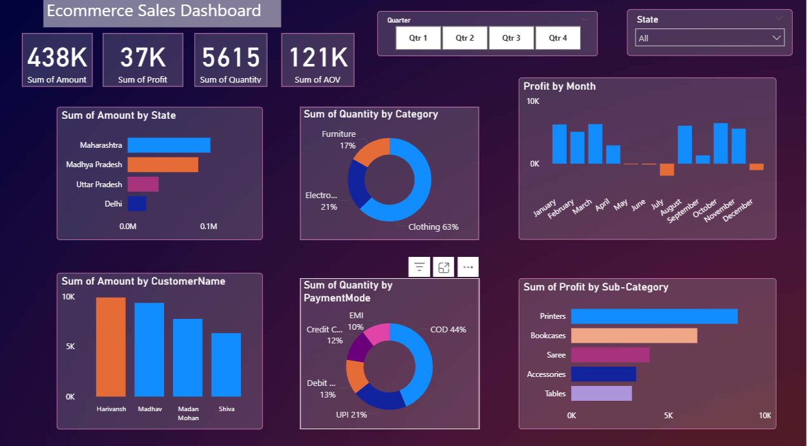

# 🛒 E-commerce Sales Analysis Dashboard  

## 📌 Executive Summary  
This Power BI dashboard provides a comprehensive analysis of e-commerce sales data, focusing on customer behavior, product performance, and regional trends. The report highlights key performance indicators (KPIs) like revenue, profit, sales quantity, and average order value (AOV), enabling businesses to make informed, data-driven decisions.  

## ❗ Business Problem  
E-commerce companies often face challenges in:  
- Identifying high-performing and underperforming products  
- Understanding customer purchasing behavior  
- Monitoring regional sales performance  
- Analyzing seasonal trends to optimize inventory and marketing  

This project addresses these issues through interactive visualizations and actionable insights.  

## 🔍 Methodology  
1. **Data Preparation** – Collected and cleaned e-commerce sales data  
2. **Data Modeling** – Created a star schema linking Fact (Orders) with Dimensions (Customer, Product, Region, Time)  
3. **Dashboard Development** – Built Power BI visuals with DAX measures to calculate KPIs  
4. **Analysis** – Identified trends, top customers, best-selling products, and payment mode preferences  
5. **Recommendations** – Suggested data-driven strategies for growth  

## 🛠 Skills & Tools  
- **Power BI** – Data modeling, DAX, KPIs, and visualization  
- **SQL / Excel (optional)** – Used for preprocessing raw data  
- **Data Analytics** – Sales analysis, customer segmentation, and profitability insights  
- **Visualization Techniques** – Bar charts, pie charts, KPIs, and slicers for interactivity  

## 📊 Dashboard Preview  
  

## 📈 Results / Key Insights  
- **Revenue:** ₹438K with ₹37K profit and 121K AOV  
- **Top Categories:** Clothing (63%) and Electronics (21%) drive the majority of sales  
- **Regional Sales:** Maharashtra contributes the highest sales among states  
- **Customer Insights:** Harivansh, Madhav, and Madan Mohan are the top buyers  
- **Payment Modes:** COD (44%) and UPI (21%) dominate transactions  
- **Profitability:** Printers and Bookcases yield the highest profit, while some categories underperform  
- **Seasonality:** Revenue and profit vary significantly across months, with dips indicating off-seasons  

## ✅ Recommendations  
- **Focus Marketing on High-Revenue Products:** Clothing and Electronics should receive targeted promotions  
- **Customer Retention:** Offer loyalty rewards to top buyers to encourage repeat purchases  
- **Inventory Planning:** Stock up during high-demand months and avoid overstocking in low-profit months  
- **Payment Optimization:** Encourage digital modes (UPI, Cards) through discounts to reduce COD dependency  
- **Product Strategy:** Reevaluate underperforming categories (e.g., Sarees, Accessories) for quality or demand issues
  

## 🚀 How to Use This Report  
1. Clone the repository  
   ```bash
   git clone https://github.com/salonig90/ecommerce-analysis.git
